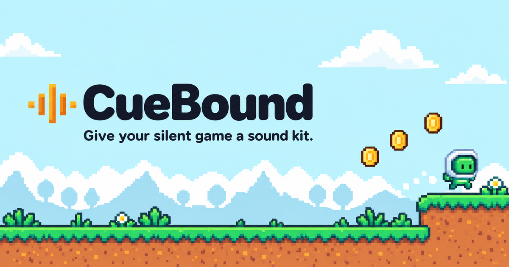
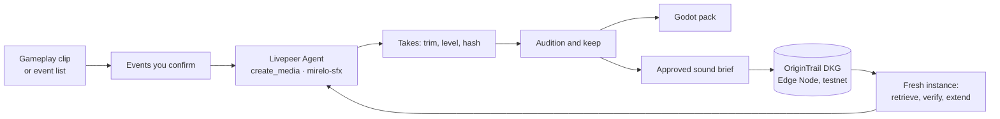

<p align="center">
  
</p>

<h1 align="center">CueBound</h1>

<p align="center"><strong>Give a silent Godot prototype a sound kit, then keep that sound identity as the game grows.</strong></p>

<p align="center">
  
  
  
  
</p>

<p align="center">
  <picture>
    <source media="(prefers-color-scheme: dark)" srcset="web/public/brand/livepeer-lockup-white.svg">
    
  </picture>
  <br>
  <sub>Sound generation powered by the Livepeer Agent network · model Mirelo SFX 1.6</sub>
</p>

---

CueBound is for a solo developer or small team with a playable 2D game and no audio. You tell it which actions need a sound (jump, land, coin pickup, hurt, UI click; any action). The **Livepeer Agent** network renders candidate sound effects for each one. You audition them as pads against your own gameplay, keep the takes that fit, and export a pack that drops into Godot.

The decisions you approved become a **sound brief** on an **OriginTrail DKG** node. A teammate, or a fresh session on another machine, can fetch that exact brief, prove it is the approved one, and add the next mechanic's sound in the same style without changing the sounds you already shipped.

**Status:** working end to end against the real Livepeer network and a real DKG Edge Node on testnet, including one brief published to the DKG's Verifiable Memory on Base Sepolia. See [Limitations](#limitations-and-unfinished-work) for what is not done.

## Contents

- [How it works](#how-it-works)
- [Architecture](#architecture)
- [Livepeer Agent integration](#livepeer-agent-integration)
- [OriginTrail DKG integration](#origintrail-dkg-integration)
- [Event list from your coding agent](#event-list-from-your-coding-agent)
- [Quick start](#quick-start)
- [Configuration](#configuration)
- [Verify it](#verify-it)
- [API overview](#api-overview)
- [Limitations and unfinished work](#limitations-and-unfinished-work)
- [Data, privacy and terms](#data-privacy-and-terms)
- [Licences and credits](#licences-and-credits)
- [Project layout](#project-layout)

## How it works

1. **Events.** Any action can have a sound; CueBound works on up to five at a time. Upload a 15–60 s gameplay clip and mark each action at the playhead, load exact times from the game's event log, or paste an event list written by your coding agent from the game's code (no clip needed). Automatic detection from video is not built.
2. **Style.** Pick one of two sound directions, for example *Soft & rounded* or *Dry & mechanical*. Hear one rendered sample of each before you commit.
3. **Listen & keep.** Livepeer renders up to three takes per event. Play them as pads (keys J, L, P, H, U), replay your clip with the kit, and stress-test with rapid-fire and overlapping plays. Keep the takes that fit. For events that repeat, CueBound asks for two kept takes so repeats alternate; a pack still exports with fewer, with the event listed as incomplete. Regenerate a single event with a note ("softer, less boomy") without touching anything you kept.
4. **Export.** Download a Godot pack: WAV files, one `AudioStreamRandomizer` per event, `cuebound_sfx.gd`, `manifest.json` with SHA-256 fingerprints, and `HOOKUP.md`. You wire the sounds yourself: `Sfx.play("jump")` where the jump happens.
5. **Save the sound brief.** Review the brief before it leaves your machine: edit the style text, event descriptions and notes, set the approver and the sharing scope, and remove events. Identity, generator and audio fingerprints are locked. Store it on your DKG node, then optionally share it with peers. Publishing it to the OriginTrail testnet as a knowledge asset with a UAL is a separate, explicit step (see [Limitations](#limitations-and-unfinished-work) for its current status).
6. **Continue.** A new, empty instance retrieves the brief from the DKG by reference. It checks the brief's fingerprint, imports the approved pack and checks every file's hash, then renders the new mechanic's sound under the brief's style and processing settings. Version 2 of the pack keeps the version 1 files byte-identical.

## Architecture



One Bun server (`server.ts`) holds the API, the job runner and a SQLite database in `DATA_DIR`, and serves the built web UI. Everything transient (clips, prompts, candidate takes, jobs) stays there. The DKG holds only the approved brief. There are no mocks anywhere in the project: the tests use real ffmpeg and, when a node is reachable, the real DKG.

## Livepeer Agent integration

Every sound in CueBound is rendered on the Livepeer Agent network. Generation is the core of the product, not a decoration.

| | |
|---|---|
| Endpoint | `https://agent.livepeer.org/api/mcp/creative`, the creative MCP surface |
| Tool | `create_media`, polled with `get_create_media`; the model card from `describe_capability`; spend from `get_cost_report` scoped to the project session |
| Model | `mirelo-sfx` (`Mirelo-AI/sfx1.6/text-to-audio`), text to sound effect, 3 s minimum, about $0.0105 per second at list price |
| Auth | Keyless demo credit by default; set `LIVEPEER_API_KEY` to send `Authorization: Bearer` |

The exact request, built in [`lib/livepeer.ts`](lib/livepeer.ts):

```json
{
  "name": "create_media",
  "arguments": {
    "action": "generate",
    "model_override": "mirelo-sfx",
    "strict": true,
    "async": true,
    "duration": 3,
    "prompt": "Small character jumps off the ground. Texture: felt and wood, rounded and playful. Envelope: quick soft attack, short gentle tail. Hierarchy: jumps and pickups stay bright; only damage sounds harsh",
    "idempotency_key": "<CueBound job id>",
    "max_cost_usd": 0.05,
    "session_id": "<project id>"
  }
}
```

`strict: true` means the model is never swapped for a sibling. A response that reports a substituted model is refused.

**Spend control** happens before any call. The server writes the job row first, refuses any batch that would take the project past its run limit, and caps each call with `max_cost_usd` (its own reservation plus an equal share of the remaining headroom, so caps can never add up past the limit). A timeout is recorded as **unknown** and never retried automatically. A status check polls the provider by job id; only when no job id was ever recorded does it re-send with the same idempotency key, within 24 hours, so Livepeer returns the original job instead of starting a new render. A job is marked as free only when the provider explicitly says it was not billed.

**Processing.** Mirelo places the sound anywhere inside its multi-second file, often quietly. [`lib/audio.ts`](lib/audio.ts) keeps the loudest window of each take, starting just before the sound rises, levels it to −1 dBFS, applies the event's loudness setting, and flags takes whose raw output was very quiet. Preview and export use the same rendered file, so what you hear is what Godot plays.

**In the UI:** the "Powered by Livepeer" badge, a Livepeer activity panel listing every call with its prompt, provider job id, status and estimated cost, a live status island while a render runs, and the model card with price and typical wait read live from the network.

## OriginTrail DKG integration

The DKG holds one small, human-approved **sound brief** per revision: the style direction, each event's role and descriptors, reviewed notes, processing settings, and the SHA-256 fingerprint of every approved audio file. Audio, clips, prompts and job state never enter the DKG.

**What the knowledge changes.** A fresh instance with no local data fetches a specific brief, proves it is the approved one (fingerprint check), proves the pack it was handed is the approved audio (per-file hashes), and only then renders the next sound under that brief. The UI shows the new prompt **with and without** the brief side by side. Descriptors go into the prompt as quoted style data, never as instructions; processing settings are applied by code. Whether the new sound fits stays a human listening decision.

| Where | What is there |
|---|---|
| Your machine only (`DATA_DIR`) | the gameplay clip, raw prompts, every candidate, rejected takes and their reasons, job history |
| DKG Working Memory (your node) | the approved brief, one new knowledge asset per revision (`brief-r<n>`) in context graph `cuebound-<projectId>`, written as RDF and read back byte-identical |
| DKG Shared Working Memory | the same brief, only after you choose a sharing scope; peers allowed on the context graph can read it |
| DKG Verifiable Memory (Base Sepolia testnet) | only a revision approved with the *published* scope, as an explicit extra step; it becomes a knowledge asset with a UAL. One dry-run brief is published so far (see [Verify it](#verify-it)) |
| Nowhere public | no clip, secret, private prompt or rejected take is ever written to the DKG |

The record lifecycle, from [`lib/dkg.ts`](lib/dkg.ts), against the Edge Node HTTP API:

```text
POST /api/context-graph/create                 { id: "cuebound-<projectId>", name }        once per project
POST /api/knowledge-assets                     { contextGraphId, name: "brief-r1" }        never overwritten
POST /api/knowledge-assets/brief-r1/wm/write   { contextGraphId, quads: [...] }            the brief as RDF triples
POST /api/query   view: working-memory         read back, re-canonicalise, compare fingerprint
POST /api/knowledge-assets/brief-r1/wm/finalize
POST /api/knowledge-assets/brief-r1/swm/share  { entities: "all" }                         only if the scope allows
POST /api/query   view: shared-working-memory  read back again
POST /api/knowledge-assets/brief-r1/vm/publish  { contextGraphId }                         explicit step; mints the asset on testnet
POST /api/query   view: verifiable-memory       read back byte-for-byte before the UAL is recorded
```

A brief is handed to a teammate as one reference string, which pins the project, revision and fingerprint, and carries the UAL once the revision is published:

```text
dkg-brief:cuebound-<projectId>/brief-r1?revision=1&sha256=<fingerprint>[&ual=did:dkg:base:84532/<publishing address>/<n>]
```

Retrieval reads the DKG only, never local storage. It parses the record with a strict schema (fixed fields, bounded lengths, numeric ranges) and treats it as data. A wrong fingerprint, a mismatched project or revision, a malformed record, or a tampered audio file blocks generation with a visible reason; nothing is merged or silently upgraded to "latest". Every DKG call first checks that the node reports testnet (`base:84532`); mainnet is refused.

## Event list from your coding agent

A clip only shows what you happened to play. [`skills/cuebound-events/SKILL.md`](skills/cuebound-events/SKILL.md) is an agent skill: a coding agent (Claude Code, Codex, or any agent that reads `SKILL.md`) reads the game's code and writes `cuebound-events.json` with every action that needs a sound, including ones a clip misses such as a checkpoint or level complete.

```json
{ "events": [ { "id": "jump", "label": "Jump", "description": "Small pixel hero springs up off a grassy tile", "recurring": true } ] }
```

Copy the folder into your agent's skills directory (for example `.claude/skills/`), ask for "the CueBound event list", then load the file on the Events screen. The descriptions become the start of each Livepeer prompt. [`mockGame/godot/cuebound-events.json`](mockGame/godot/cuebound-events.json) is the list for the reference game.

## Quick start

**Requirements**

| Tool | Version | Needed for |
|---|---|---|
| [Bun](https://bun.sh) | 1.4+ | server, tests, UI build |
| ffmpeg and ffprobe | any recent | clip checks and take processing |
| [OriginTrail DKG Edge Node](https://docs.origintrail.io) | `@origintrail-official/dkg@10.0.18` | the sound brief features (the rest works without it) |
| Godot | 4.7.2 | the reference game and recording (optional) |
| jq | any | `mockGame/record-clip.sh` |

```bash
# 1. DKG Edge Node on testnet. Local and shared memory need no tokens.
npm install -g @origintrail-official/dkg@10.0.18
dkg init --network testnet --role edge      # keep API authentication on
dkg start

# 2. Build the UI, then start the server. It serves the UI and the API on http://127.0.0.1:3000
git clone <this repository> cuebound && cd cuebound
bun run build
DATA_DIR=data-demo bun run start
```

Open http://127.0.0.1:3000. The first generation spends Livepeer credit, about $0.03 per take.

**Publishing to the testnet** (optional) needs two more things on the node:

- Base Sepolia ETH and test TRAC on the node's operational wallet (`dkg init` requests TRAC from the faucet; ETH comes from any Base Sepolia faucet).
- An RPC that serves historical logs. The first publish of a context graph scans `ContextGraphCreated` events from the registry's deploy block, and the default public RPCs prune or refuse that range. In `~/.dkg/config.json` set the `chain` block to an endpoint that serves it, then restart the node:

  ```json
  { "rpcUrl": "https://base-sepolia.gateway.tenderly.co", "cgRegistryScanPageSize": 1000000, "rpcUrls": [] }
  ```

**Record the reference game** (`mockGame/godot`, art by Kenney, CC0):

```bash
bash mockGame/record-clip.sh ~/cuebound-take1
#   play: A/D move, Space jump, Shift dash, click "Reset coins", Esc to stop; the exit door ends the recording
bun mockGame/seed-cues.ts --events ~/cuebound-take1/events.json --clip ~/cuebound-take1/gameplay.mp4
```

**Continue in a fresh instance** (the DKG handoff):

```bash
DATA_DIR=/tmp/cuebound-fresh PORT=3001 bun run start
```

Open http://127.0.0.1:3001, choose *Continue from a saved sound brief*, paste the reference shown on the Export screen, import the exported pack folder, then add the new mechanic.

## Configuration

Copy [`.env.example`](.env.example) to `.env` or export the variables. Every value is optional.

| Variable | Default | Purpose |
|---|---|---|
| `DATA_DIR` | `./data` | local project storage; one folder per instance |
| `PORT`, `HOST` | `3000`, `127.0.0.1` | the server has no login; keep it on loopback |
| `LIVEPEER_API_KEY` | unset | a Livepeer key instead of keyless demo credit |
| `LIVEPEER_MCP_URL` | the creative endpoint | override for testing |
| `DKG_API_URL`, `DKG_HOME`, `DKG_AUTH_TOKEN` | `http://127.0.0.1:9200`, `~/.dkg`, read from `auth.token` | where the node and its token are |
| `ASSET_BASE_URL` | unset | public https location of the pack, recorded in the brief |
| `EXPECTED_PROJECT_ID` | unset | refuse briefs from any other project |

`GET /api/health` reports whether ffmpeg, ffprobe, Godot, a zip tool, the DKG node and Livepeer are reachable.

### Hosted demo

[cuebound.timidan.xyz](https://cuebound.timidan.xyz) runs the same code with `HOSTED=1`, from the [`Dockerfile`](Dockerfile), next to its own DKG Edge Node on testnet. What changes in hosted mode:

| Variable | Default | Hosted behaviour |
|---|---|---|
| `HOSTED` | unset | `1` gives each visitor their own project, chosen by a session cookie and stored under `DATA_DIR/sessions/` |
| `SESSION_CAP_USD` | `1` | the most one visitor can spend; a higher spend limit is lowered to it |
| `DAILY_CAP_USD` | `20` | the most all visitors together can spend per day |

The pack import accepts only a pack folder this server exported (paste the folder shown on the Export screen). Publishing to testnet is turned off, because it writes to the public DKG for good; run CueBound locally to publish.

## Verify it

```bash
bun test                                          # pack export with real ffmpeg; brief canonical form and fingerprint;
                                                  # a live store-and-retrieve on the DKG node (skipped when no node is reachable)
godot --headless --path mockGame/godot --import    # the reference game imports cleanly
curl -s http://127.0.0.1:3000/api/health          # dependencies and services
```

Checked by hand on 25 September 2026 against the real services:

- **DKG round trip.** A brief was stored, read back, shared and read back again on a local testnet Edge Node. A second instance with an empty data folder retrieved it from shared memory, rejected a reference with a wrong fingerprint, flagged a pack with one altered byte, and rendered a real dash take with the brief's fragment in the prompt.
- **Version 2 export** kept the version 1 audio byte-identical.
- **Spend controls.** A request over the run limit was refused with nothing submitted. With Livepeer unreachable, the job became *unknown*, was never retried, and a manual status check created no second job.
- **Godot.** Exported packs import and play in Godot 4.7.2; the pickup sound in a recorded run starts within 11 ms of the logged event.
- **Testnet publication.** Revision 2 of the development project's brief (one event, coin pickup with two takes; nothing sensitive) was approved with the *published* scope, stored, shared, then published to Verifiable Memory and read back byte-for-byte from that view.
  - UAL: `did:dkg:base:84532/0x4d5a2a0e6e7a3f3fd9acd1e6709545f568108023/35`
  - Transaction: [`0x7b8821cf…d4f5341`](https://sepolia.basescan.org/tx/0x7b8821cfe53e5562246d421b5844b0fdaf4302a914249f969ef22b406d4f5341), block 47 285 409, status success on two independent RPCs (sepolia.base.org and publicnode)
  - Context graph `cuebound-94c2dfe3-…` registered on-chain by that first publish; the node's descriptor reports `published` / `vm-confirmed`
  - Node `@origintrail-official/dkg` 10.0.18, network `testnet base:84532`
  - An empty app instance then called `/api/continue` with the `&ual=` reference and got the brief back from the **verifiable-memory** view, fingerprint-verified (`retrieved+verified-by-consumer`); the node's descriptor fetched by UAL reports `published` / `vm-confirmed`, asset number 35

## API overview

All routes are JSON on the local server; the full list with shapes is in [`lib/types.ts`](lib/types.ts).

| Route | Purpose |
|---|---|
| `GET /api/state` | the whole project: events, takes, jobs, styles, briefs, receipts, spend |
| `POST /api/project`, `POST /api/clip`, `PUT /api/cues`, `PUT /api/directions` | set up the project, upload the clip, edit events and styles |
| `POST /api/generate`, `POST /api/cues/:id/regenerate`, `GET /api/jobs/:id` | render takes on Livepeer; check or reconcile a job |
| `POST /api/takes/:id` | keep, skip or restore a take |
| `POST /api/export` | build the Godot pack and its zip |
| `GET /api/brief/preview`, `POST /api/brief/approve` | derive and approve a sound brief revision |
| `POST /api/brief/:revision/store`, `POST /api/brief/:revision/share`, `POST /api/brief/:revision/publish` | write it to the DKG node; share it with peers; publish it to the testnet (only for a revision approved with the *published* scope) |
| `POST /api/continue`, `POST /api/baseline/import`, `POST /api/extend` | fresh-instance handoff: retrieve, verify the pack, add a mechanic |
| `GET /api/livepeer`, `GET /api/cost-report`, `GET /api/health` | model card, session spend, dependency checks |

## Limitations and unfinished work

- **The published brief is the dry run.** The asset on testnet is revision 2 of the development project, published to prove the path. The demo project's own brief will be published as its own asset once its sounds are approved.
- **One node.** Store, share, publish and the fresh-instance handoff were all verified against the same local node (a fresh app instance, not a fresh node). Reading a shared brief from a second node requires that node to be an allowed peer of the context graph, and retrieval by UAL from another node was not tested.
- **Publishing depends on an RPC that serves log history**, as described in Quick start; the node's default public RPCs did not.
- **Events are marked by hand,** loaded from an event log, or listed by your coding agent. Video analysis is not built.
- **Sound quality is a human judgement.** CueBound never scores sounds, and the model does not have to follow the brief; the brief is quoted to it as style data.
- **Editing after approval.** Changing an event's loudness after approving a brief re-renders its kept takes locally. The exported pack for that revision keeps its bytes; save a new brief revision afterwards.
- **Cost figures are estimates** from the registry price until the provider reports an actual cost.

## Data, privacy and terms

**What leaves your machine.** Each event's description and the chosen style go to the Livepeer network as a text prompt. Nothing else does: the clip is never uploaded anywhere, and only the approved brief goes to the DKG node you run. Keep secrets, private names and personal data out of event descriptions.

**Generated audio.** Sounds are rendered by Mirelo SFX 1.6 through Livepeer's routing to fal.ai. The three parties' published terms do not state which tier applies to audio rendered this way:

- Mirelo's terms grant users the right to use and commercialise outputs (§7.3) but restrict *Free Plan* outputs to non-commercial use (§2.1) and ask for attribution (§7.5): https://mirelo.ai/terms
- fal.ai's model page marks the model for commercial use; fal's terms disclaim ownership warranties on outputs: https://fal.ai/terms
- Livepeer Agent's demo credits are evaluation credits; no separate output-licensing terms were published for the Agent endpoint at the time of writing: https://agent.livepeer.org

CueBound therefore treats generated audio as evaluation material, credits Mirelo in every exported pack (`manifest.json` and `HOOKUP.md`: "Sound effects powered by Mirelo AI"), and claims no commercial rights. Check the terms yourself before shipping generated sounds in a commercial game. CueBound's MIT licence covers its code, not the audio it renders.

## Licences and credits

| Component | Licence | Notes |
|---|---|---|
| CueBound code | [MIT](LICENSE) | |
| Reference game art | CC0 1.0, [Kenney "Pixel Platformer"](https://kenney.nl/assets/pixel-platformer) | [`mockGame/godot/CREDITS.md`](mockGame/godot/CREDITS.md) |
| Landing art and pixel icons | Generated for this project | prompts and processing in [`web/public/art/PROVENANCE.md`](web/public/art/PROVENANCE.md) |
| UI components | SmoothUI (MIT), Magic UI (MIT), shadcn/ui (MIT), Phosphor Icons (MIT), Fontsource fonts (OFL 1.1) | [`web/THIRD_PARTY.md`](web/THIRD_PARTY.md) |
| Livepeer logo | Official brand assets from [livepeer.org/brand](https://livepeer.org/brand), used unmodified | [`web/public/brand/SOURCE.md`](web/public/brand/SOURCE.md) |
| Sound generation | Livepeer Agent network · Mirelo SFX 1.6 by Mirelo AI | see terms above |

## Project layout

```text
server.ts                 Bun server: API, job runner, SQLite in DATA_DIR, serves web/dist
lib/livepeer.ts           Livepeer creative MCP client, spend caps, safe result download
lib/audio.ts              ffmpeg decode, loudest-window trim, levelling, WAV writer
lib/brief.ts              sound brief schema, canonical form, fingerprint, prompt fragments
lib/dkg.ts                Edge Node client: store, share, retrieve, verify
lib/pack.ts               Godot pack export (.tres, cuebound_sfx.gd, manifest.json, HOOKUP.md)
lib/types.ts              shared types and the route list
web/                      React + Tailwind UI (SmoothUI, Phosphor icons); builds to web/dist
mockGame/godot/            reference platformer (Kenney CC0 art) with an event log
mockGame/record-clip.sh    record yourself playing; writes gameplay.mp4 and events.json
mockGame/seed-cues.ts      load a recorded session into a running server
skills/cuebound-events/   agent skill that writes the event list from a game's code
```
